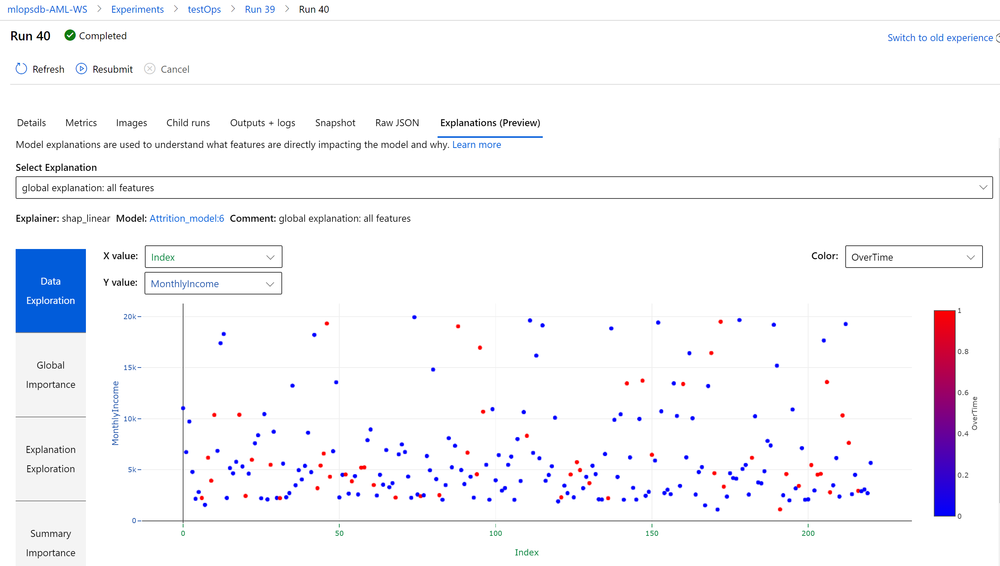
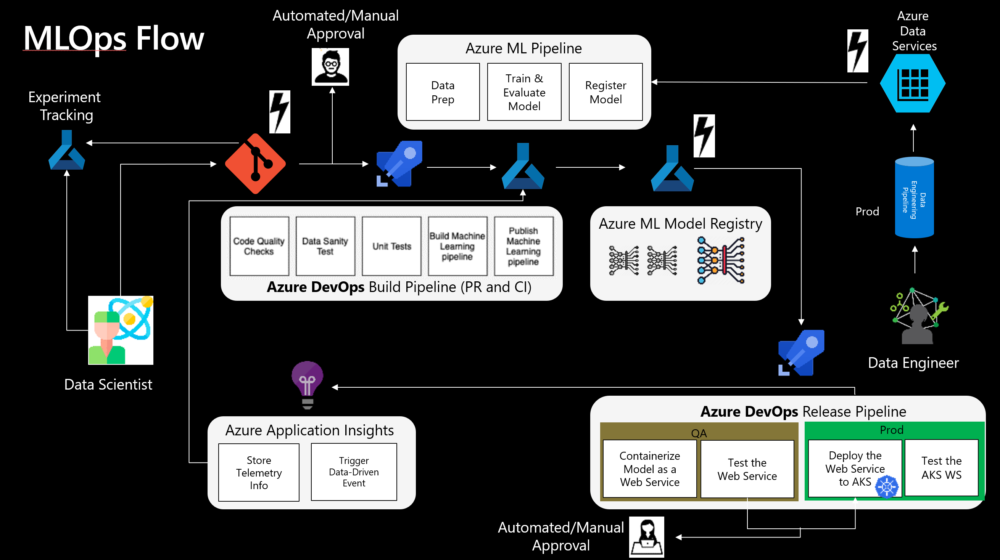

# MLops example

Note: This repo is a fork from https://github.com/danielsc/azureml-workshop-2019/, all the credit to Daniel.

This repo provides a curated example of a MLops cycle where we train a model while showing main capabilities of AzureML and automate tedious tasks like model tracking, metric logging, explainabiliy, unit test, etc

Main addons on top of danielsc's repo:
- Fix of Azure Devops build pipeline to use AzureML pipeline (and avoid calling the python script straightaway)
- Addon of metric logging, to make them available in the model registry
- Addon of interpretability section, viewable in the AzureML unit

- Placeholder for Unit testing steps in AzureML pipeline
- Placeholder to trigger a build pipeline whenever our dataset changes
- Linkage with Azure Monitoring

Notes for trigger:
- Blobstorage container with a trigger function when something new lands: https://docs.microsoft.com/en-us/azure/azure-functions/functions-bindings-storage-blob?tabs=python#trigger---example 
- Function calls https://docs.microsoft.com/en-us/rest/api/azure/devops/build/builds/queue?view=azure-devops-rest-5.1 (some help here: https://docs.microsoft.com/en-us/rest/api/azure/devops/?view=azure-devops-rest-5.1)
- Dont forget to add the connection details as seen here: https://docs.microsoft.com/en-us/azure/azure-functions/functions-how-to-use-azure-function-app-settings#settings

E2E this is the MLops architecture we implement:
